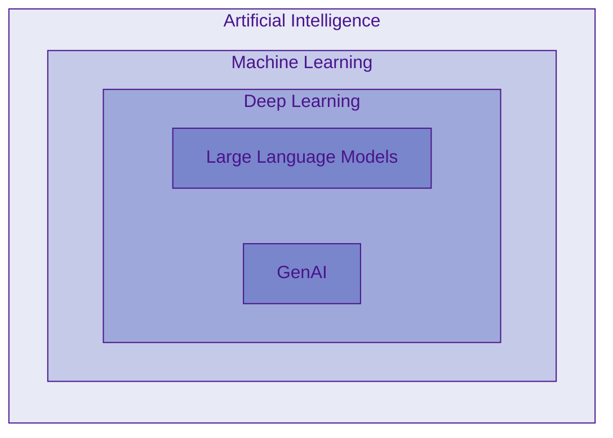

## Introduction
Large Language Models (LLMs) represent a significant advancement in Natural Language Processing (NLP), offering unprecedented capabilities in understanding and generating human-like text. These models have transformed how we interact with artificial intelligence, enabling more natural and sophisticated language processing tasks.

## What are LLMs?

- Deep neural networks trained on massive amounts of text data
- Designed to understand, generate, and respond to human-like text
- Contain billions of parameters (adjustable weights)
- Based primarily on the Transformer Architecture
- Part of the broader field of generative AI 

## Hierarchical Context

## Architecture and Components

### Transformer Architecture
The foundation of modern LLMs is the transformer architecture, introduced in 2017 in the famous paper [Attention_is_all_you_need](../resources/Attention_is_all_you_need.pdf)
- **Encoder**: Processes input text
- **Decoder**: Generates output text
- **Self-attention mechanism**: Allows the model to weigh the importance of different words in context

### Transformer-Based Models

1. BERT Models
   - Focus on text understanding
   - Use mainly encoder components
   - Specialized in classification tasks
   - Example application: Content moderation

2. GPT Models
   - Focus on text generation
   - Use mainly decoder components
   - Specialized in generative tasks
   - Example application: ChatGPT

## Training Process

### 1. Pretraining
- Trained on vast amounts of raw text data
- Uses next-word prediction as the primary task
- Creates a foundation model
- Requires significant computational resources
- Example dataset composition (GPT-3):
	
	- CommonCrawl (filtered): 60%
	- WebText2: 22%
	- Books: 16%
	- Wikipedia: 3%

### 2. Finetuning
- Further training on specific tasks or domains
- Uses smaller, labeled datasets
- Two main categories:
  - Instruction finetuning
  - Classification finetuning

## Advantages Over Traditional NLP
- No manual feature extraction needed
- Broader task compatibility
- Better understanding of context
- More natural language generation
- Improved adaptability to new tasks

## Limitations and Considerations
- High computational costs for training
- Large dataset requirements
- Resource-intensive deployment
- Need for careful evaluation and testing

**Remember:** When we say LLMs "understand" language, we mean they can process and generate text in contextually relevant ways, not that they possess human-like consciousness or comprehension.
