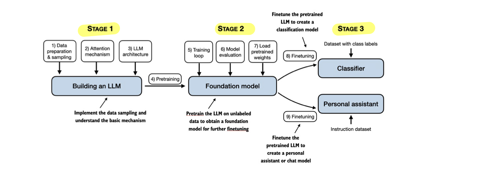

## Introduction
Large Language Models (LLMs) represent a significant advancement in Natural Language Processing (NLP), offering unprecedented capabilities in understanding and generating human-like text. These models have transformed how we interact with artificial intelligence, enabling more natural and sophisticated language processing tasks.

## What are LLMs?

- Deep neural networks trained on massive amounts of text data
- Designed to understand, generate, and respond to human-like text
- Contain billions of parameters (adjustable weights)
- Based primarily on the Transformer Architecture
- Part of the broader field of generative AI 

## Hierarchical Context

## Architecture and Components

### Transformer Architecture
The foundation of modern LLMs is the transformer architecture, introduced in 2017 in the famous paper [attention is all you need](Attention_is_all_you_need.pdf) it changes everything. 

Before transoformers, models had to process words one at a time, making them way slower, less efficent and loosing context over long texts. 

Key breakthrough -> **Self-attention** = adding attention layers between encoders/decoders

- **Encoder**: Processes input text
- **Decoder**: Generates output text
- **Self-attention mechanism**: Allows the model to weigh the importance of different words in context

### Transformer-Based Models

1. BERT Models
   - Focus on text understanding
   - Use mainly encoder components
   - Specialized in classification tasks
   - Example application: Content moderation

2. GPT Models
   - Focus on text generation
   - Use mainly decoder components
   - Specialized in generative tasks
   - Example application: ChatGPT

## Training Process

### 1. Pretraining

Pretraining is the first step of a model training. A huge ammount of text data is used for this fase to give the model the ability to understand and generate text. 
A model after pretraining is called "foundation model".

- Uses next-word prediction as the primary task
- Creates a foundation model
- Requires significant computational resources
- Example dataset composition (GPT-3):

<table>
  <tr>
    <th>Dataset</th>
    <th>Percentage</th>
  </tr>
  <tr>
    <td>CommonCrawl (filtered)</td>
    <td>60%</td>
  </tr>
  <tr>
    <td>WebText2</td>
    <td>22%</td>
  </tr>
  <tr>
    <td>Books</td>
    <td>16%</td>
  </tr>
  <tr>
    <td>Wikipedia</td>
    <td>3%</td>
  </tr>
</table>

### 2. Finetuning

Finetuning is the process of taking pretained models and further train them on smaller, more specific datasets in order to excel in specific domains. 

- Uses smaller, labeled datasets
- Two main categories:
  - Instruction finetuning: consist in finetuning the model on how it should answer using training it on pairs of text and completitions. 
  - Classification finetuning: consist in finetuning the model on classification tasks training it on pairs of text and classification labels.

  

## Advantages Over Traditional NLP
- No manual feature extraction needed
- Broader task compatibility
- Better understanding of context
- More natural language generation
- Improved adaptability to new tasks

## Limitations and Considerations
- High computational costs for training
- Large dataset requirements
- Resource-intensive deployment
- Need for careful evaluation and testing

**Remember:** When we say LLMs "understand" language, we mean they can process and generate text in contextually relevant ways, not that they possess human-like consciousness or comprehension.
