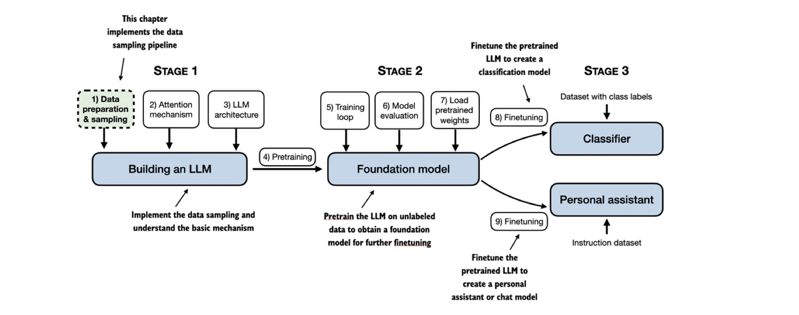
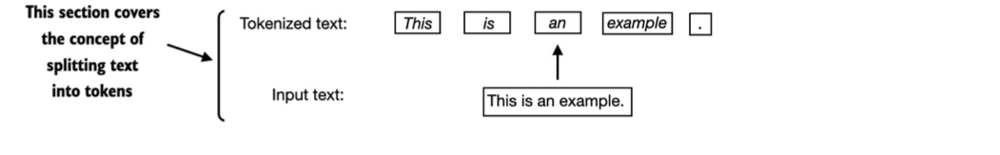
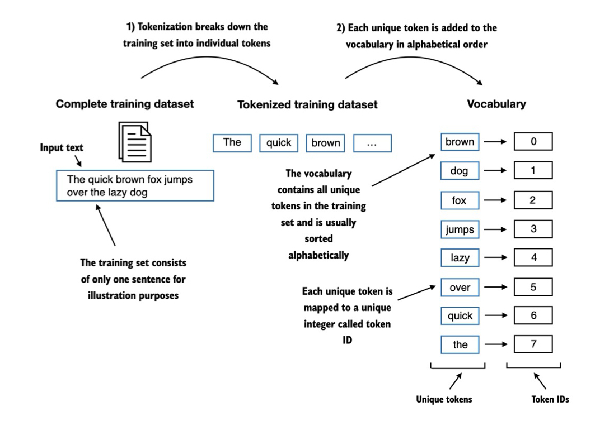
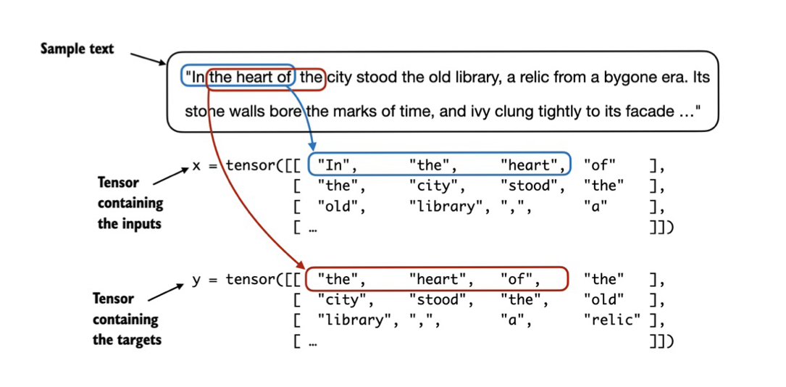
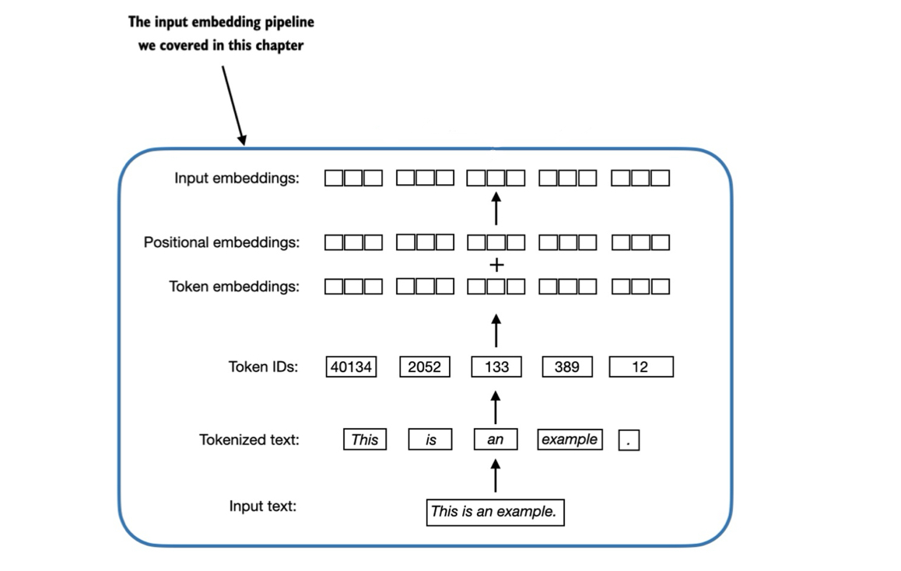

# WORKING WITH TEXT DATA
The first step to train our model is to prepare out text data for the pretraining phase. 
LLMs cannot directly process raw text because they work with mathematical operations that require numerical inputs.
To do so we have to convert the data in a format that the model can understand, in order to do so we need to: 
1. Transfor text in tokens
2. Converting tokens to numerical IDs
3. Encode the tokens into vector rappresentations (embeddings)
4. Adding positional information


## Tokenizing Text
Tokenization is the process of breaking down text into smaller units called tokens. These can be words, subword units or even characters. 

- Tokens can be individual words
- Tokens include punctuation marks, whitespaces and special characters
- Whitespace handling is important for preserving text structure




## Token IDs and Vocabulary
After splitting text into tokens, we need a way to rappresent the tokens numerically. To do so we assign each of the token obtained from the previous step a Token ID and then we map the reletionship between tokens and token IDs in a so called "vocabulary". 



But with this method, even considering bigger datasets, our model will not be able to process unkown words that were not part of the training dataset. 
In order to fix this problem, we need to have a bigger vocabulary containing usual subwords or even single characters. To do so, we use Byte Pair Encoding:

## Byte Pair Encoding (BPE)

BPE is an advanced tokenization algorithm used in modern LLMs like GPT-2 and GPT-3. Unlike simple word-based tokenization, BPE can handle any text by breaking down unknown words into smaller  units.

An open-source library to implement BPE is **tiktoken**.  

How BPE works:
- Starts with all individual characters in the vocabulary
- Iteratively merges most frequent character pairs
- Creates subword units based on frequency
- Can handle any word by decomposing it into known subwords

## Data Sampling for Training
As we have seen LLMs are trained by predicting the next word in a text, so we need to create the input-target pairs that allow the model to learn to predict the next word in a sequence. 
This is done using a **sliding window approach**.

In order to do so, the easiest way is to create two variables x and y, the first containing the input tokens and the second the target, which are basically the input slided by 1 (or more).


**Last task before turning tokens into embeddings:**
We need to implement an efficent data loader that returns the input and tragers as PyTorch tensors (multidimensional arrays), and in particular each batch becomes two tensors: 

- an input tensor 
- a target tensor with the targets for the LLM to predict


Two tensors with sliding window:



## Token Embeddings

Token embeddings are continuous vector representations of words that LLMs can process. Think of them as converting words into lists of numbers that capture the word's meaning.

**The embedding process in simple terms:**

We start from token IDs. For example:
```
[2, 3, 5, 1] (each number represents a different word)
```

**We instantiate and embedding layer:**
- Contains random numbers at first
- Has two important dimensions:
  * Number of rows = vocabulary size (how many words we know)
  * Number of columns = embedding size (how many numbers represent each word)
 
Example with a small vocabulary (6 words) and small embeddings (3 numbers per word):

```
Token ID 3 → [-0.4015, 0.9666, -1.1481]
```

**Important Points to Remember:**

1. Structure:
   - Each word gets the same number of values
   - A bigger embedding size (like GPT-3's 12,288) can capture more information about each word

3. Training:
   - Embeddings start with random values
   - Values are adjusted during model training
   - Similar words end up with similar numbers

**Key concepts of embeddings:**
- Each token is represented as a fixed-length vector
- Vector dimensions typically range from 256 to 12,288
- Similar words tend to have similar embedding vectors
- Embeddings are learned during model training


## Positional Encoding

LLM attention mechanisms don't inherently understand token order, so we need to add positional information to the embeddings. This helps the model understand the sequence structure of the input.

Types of positional encoding:
- **Absolute:** Each position has a unique embedding (Use for example by OpenAI GPTs)
- **Relative:** Encodes relationships between token positions

Implementation details:
- Positional embeddings have same dimension as token embeddings
- Added directly to token embeddings
- Enables the model to understand token order in sequences





---

THE CREDITS FOR ALL THE IMAGES CONTAINED IN THIS FILE GOES TO THE AUTHOR OF THE BOOK "BUILD AN LLM FROM SCRATCH" USED AS LEARNING MATERIAL FOR THE CREATION OF THIS NOTE. 